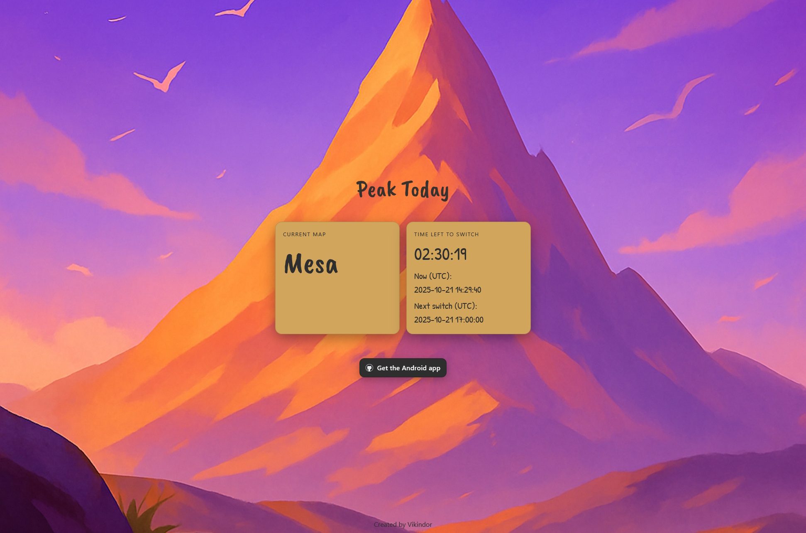

<h2 align="center">
Peak Today (Web)
</h2>

## 📌 About

**Peak Today (Web)** is the browser-based version of the non-commercial fan-made application that helps track the current map (biome) rotation in the game **[PEAK](https://landfall.se/peak)** by Landfall Games.

## ⚠ Disclaimer

This is an **unofficial project**. It is not affiliated with or endorsed by Landfall Games.
The project does not use any original game assets. All rights to **PEAK** and its assets belong to Landfall Games.
No copyright or trademark infringement is intended.

## 🌐 Live Demo

  
👉 Open it here: **[vikindor.github.io/peaktoday](https://vikindor.github.io/peaktoday/)**

## ✨ Features

- Display of the current active biome
- Countdown timer until the next map switch
- UTC-based synchronization (same as in the Android version)
- Minimalistic adaptive UI

## 🖼 Screenshots

## 🛠 Tech stack

- HTML + CSS  
- JavaScript
- GitHub Pages

## 📜 License

This project is licensed under the [MIT License](LICENSE).
